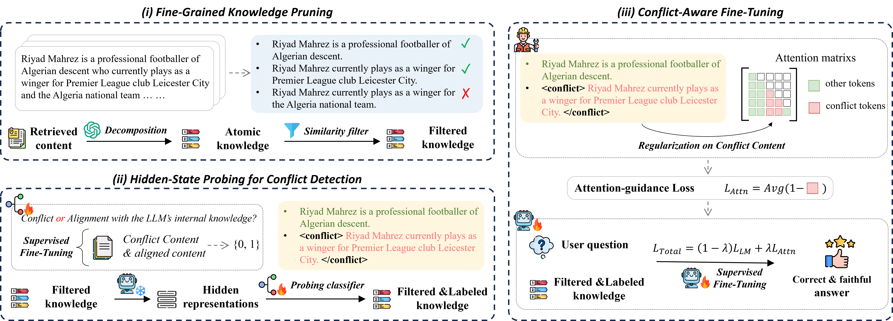

# Probing Latent Knowledge Conflict for Faithful Retrieval-Augmented Generation

Code repository for paper: Probing Latent Knowledge Conflict for Faithful Retrieval-Augmented Generation

This repository provides an evaluation framework for paper: Probing Latent Knowledge Conflict for Faithful Retrieval-Augmented Generation, focusing on **knowledge intensive QA tasks**. The core method is based on **CLEAR**, with comparisons to several baseline and alternative approaches.



## Features

* **Automated QA Evaluation**
  Computes **F1 score** and **Exact Match (EM)** automatically.

* **Multi-model Support**
  Works with **LLaMA**, **Qwen**, **Mistral**, and other open-source LLMs.

* **Dataset Coverage**
  Includes benchmarks such as **FaithEval**, **ConFiQA**, and **SQuAD**.

* **Multiple Baselines**
  Supports `CLEAR`, `WO-Context`, `KRE`, `OPIN`, `CANOE`, `ContextDPO`, etc.

## Project Structure

```
src
├── dataset_wrapper.py        # Dataset wrappers (RAGDataset, ConFiQA, FaithEval, Squad, etc.)
├── modules.py                # Core modules (e.g., ConflictDetector)
├── classifier.py             # Classifier Definition
├── prompt_template.py        # Prompt Template
├── vector_extractor.py       # Hidden State Extractor
├── utils.py                  # Utility functions (model loading, etc.)
scripts
├── evaluate_qa.py            # Main evaluation script
├── classifier_training.py    # Classifier trainging script
├── llm_sft.py                # LLM fine-tuning script
├── prepare_sft_data.py       # SFT data preparation script
├── train_sft.sh              # LLM fine-tuning start script
```

## Key Components

* **QAEvaluator**
  The main evaluation class. It:

  1. Generates prompts and gold answers
  2. Runs inference with the target model
  3. Computes evaluation metrics (F1, EM)
  4. Saves detailed results to JSON

* **Metrics**

  * `f1_score`: token-level F1 based on word overlap
  * `exact_match_score`: exact match, with special handling for negation in counterfactual QA

## Supported Datasets

* **FaithEval / Counterfactual QA**
* **ConFiQA** (MC, MR, QA subsets)
* **SQuAD**

Dataset paths are configured in `dataset_dict`, and new datasets can be added easily.

## Supported Models

* **Meta-LLaMA-3.1-8B-Instruct**
* **LLaMA-2-7B-Chat**
* **Qwen2.5-7B-Instruct**
* **Qwen3-8B**
* **Mistral-7B-Instruct-v0.3**

Mappings are defined in `model_dict` for easy extension.

## Usage

1. **Prepare data and models**

   * Place datasets under `data/`
   * Store model weights under `checkpoints/` or specify their path

2. **Run evaluation**

   ```bash
   python scripts/evaluate_qa.py
   ```

3. **Results**

   * Results are saved to:

     ```
     experiments/qa_exp/{dataset}/{method}-{model}-{date}.json
     ```
   * Each file includes overall metrics and per-case predictions

Example output:

```json
[
    {
        "total_f1": 0.6123,
        "total_em": 0.4321
    },
    {
        "question": "...",
        "answer": ["gold answer 1", "gold answer 2"],
        "predict": "predicted answer",
        "f1": 0.75,
        "em": 1
    }
]
```

# Citation
If you find this work helpful, please cite our paper:
```
@article{gao2025probing,
  title={Probing Latent Knowledge Conflict for Faithful Retrieval-Augmented Generation},
  author={Gao, Linfeng and Bi, Baolong and Yuan, Zheng and Wang, Le and Chen, Zerui and Wei, Zhimin and Liu, Shenghua and Zhang, Qinggang and Su, Jinsong},
  journal={arXiv preprint arXiv:2510.12460},
  year={2025}
}
```
